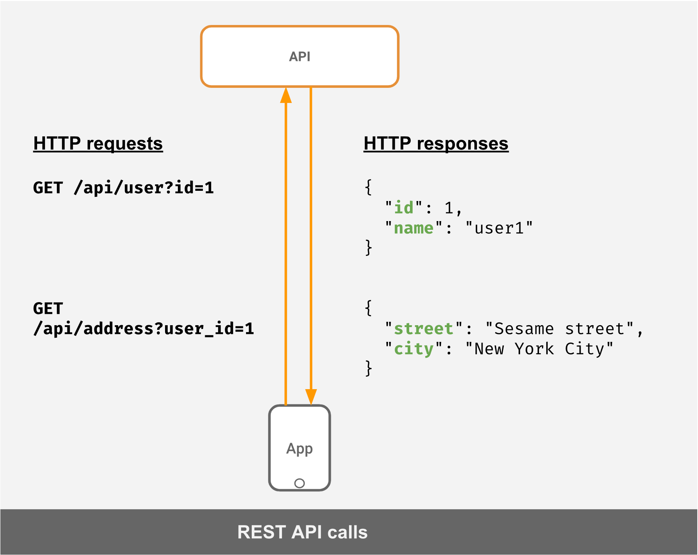
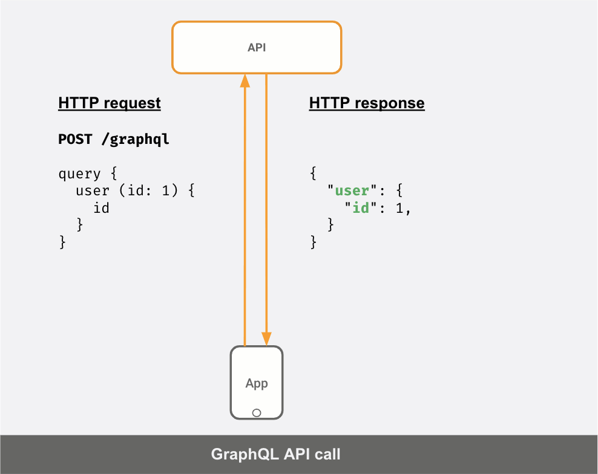

# GraphQL

- [O que é o GraphQL?](#o-que-é-o-graphql)
- [GraphQL vs REST](#graphql-vs-rest)
- [Principais conceitos](#principais-conceitos)
- [Queries](#queries)
- [Mutations](#mutations)
- [Subscriptions](#subscriptions)
- [Exemplos](https://github.com/zanchettouw/notes/tree/master/graphql/examples)

### O que é o GraphQL? ###

É uma query language utilizada para se comunicar  com APIs. Geralmente utilizada sobre o protocolo HTTP. A principal ideia é ter um único endpoint que recebe um post e devolve a informação baseada no modelo que foi solicitado. Evitando assim a necessidade de vários endpoints e mantendo o retorno sempre enxuto.
### GraphQL x REST ###

#### Requisição utilizando Rest ####

#### Requisição utilizando GraphQL ####

### Principais conceitos ###
### Queries ###

### Mutations ###
### Subscriptions ###

### Exemplos ###

Seguindo toda essa teoria, criei alguns exemplos utilizando o [vue](https://vuejs.org/) e esta [api pública](https://api.spacex.land/graphql/) da SpaceX.
Escolhi o vue por ter familiaridade e  porque existe uma ferramenta muito maneira para trabalhar com o graphql chamada [vue-apollo](https://apollo.vuejs.org/). Essa [note](https://github.com/zanchettouw/notes/tree/master/graphql/vue-apollo.md) fala mais sobre isso.
