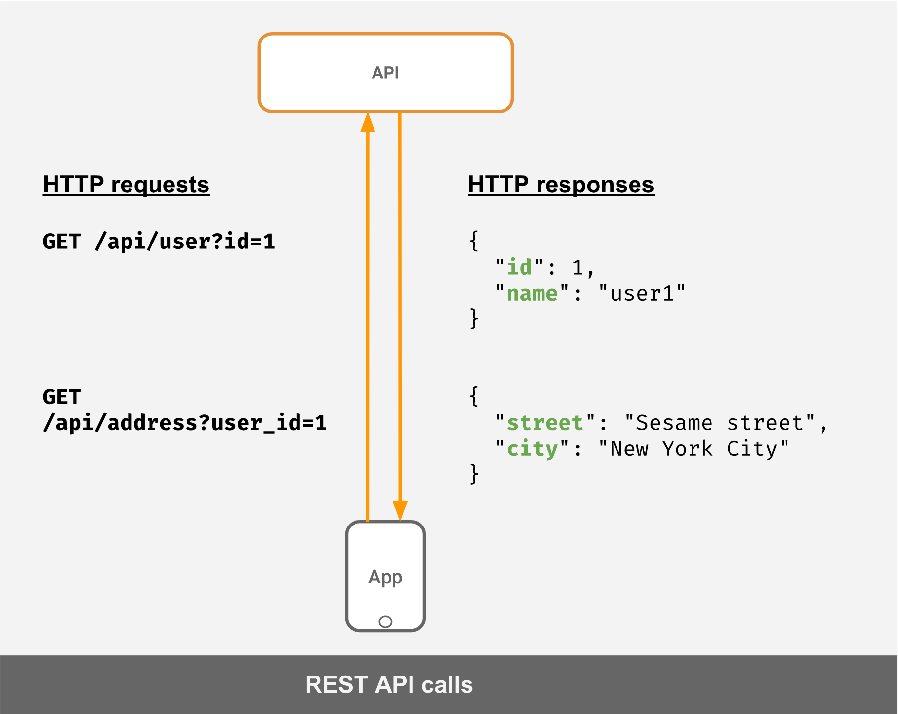

# GraphQL

- [O que é o GraphQL?](#o-que-é-o-graphql)
- [GraphQL vs REST](#graphql-vs-rest)
- [Queries](#queries)
- [Mutations](#mutations)
- [Subscriptions](#subscriptions)
- [Exemplos](https://github.com/zanchettouw/notes/tree/master/graphql/examples)

### O que é o GraphQL? ###

É uma query language utilizada para se comunicar  com APIs. Geralmente utilizada sobre o protocolo HTTP. A principal ideia é ter um único endpoint que recebe um post e devolve a informação baseada no modelo que foi solicitado. Evitando assim a necessidade de vários endpoints e mantendo o retorno sempre enxuto.
### GraphQL x REST ###

#### Requisição utilizando Rest ####
Essa é a maneira que faríamos as requisições para uma api REST nos retornar o endereço de um usuário.

referência: <a href="https://hasura.io/learn/graphql/intro-graphql/graphql-vs-rest/" target="_blank">Hasura</a>

#### Requisição utilizando GraphQL ####
E essa é a meneira que conseguiríamos as mesmas informações através de uma requisição para uma api GraphQL

referência: <a href="https://hasura.io/learn/graphql/intro-graphql/graphql-vs-rest/" target="_blank">Hasura</a>

#### Alguns dos benefícios do GraphQL ####

- <strong>Mantém os retornos enxutos:</strong> Como todas as requisições deverão retornar exatamente o modelo solicitado, evita que dados desnecessário sejam retornados.

- <strong>Diminui a necessidade de multiplas requisições:</strong> Cada requisição terá exatamente o que necessita, ou seja, não precisa fazer mais de uma.

Alguns termos do REST podem ser traduzidos da seguinte maneira para o universo do GraphQL

<table>
  <thead>
    <tr>
      <th>Requisição</th>
      <th>Rest</th>
      <th>GraphQL</th>
    </tr>
  </thead>
  <tbody>
    <tr>
      <td>
        Solicitar informações
      </td>
      <td>
        GET
      </td>
      <td>
        Query
      </td>
    </tr>
    <tr>
      <td>
        Persistir informação
      </td>
      <td>
        POST
      </td>
      <td>
        Mutation
      </td>
    </tr>
    <tr>
      <td>
        Atualizar/deletar informação
      </td>
      <td>
        PUT/PATCH/DELETE
      </td>
      <td>
        Mutation
      </td>
    </tr>
    <tr>
      <td>
        Watching/subscribing informação
      </td>
      <td>
        -
      </td>
      <td>
        subscription
      </td>
    </tr>
  </tbody>
</table>

### Queries ###

### Mutations ###
### Subscriptions ###

### Exemplos ###

Seguindo toda essa teoria, criei alguns exemplos utilizando o [vue](https://vuejs.org/) e esta [api pública](https://api.spacex.land/graphql/) da SpaceX.
Escolhi o vue por ter familiaridade e  porque existe uma ferramenta muito maneira para trabalhar com o graphql chamada [vue-apollo](https://apollo.vuejs.org/). Essa [note](https://github.com/zanchettouw/notes/tree/master/graphql/vue-apollo.md) fala mais sobre isso.
